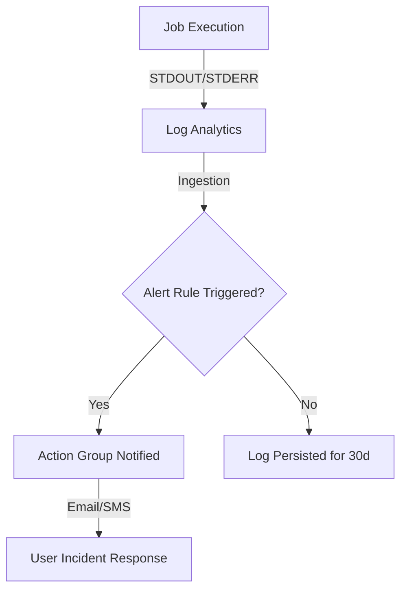

# Data Model: Monitoring & Alerting

This feature leverages Azure Monitor and Log Analytics. The "data model" here refers to the infrastructure entities and their relationships.

## Entities

### `LogAnalyticsWorkspace`

The primary data sink for all container logs.

- **Retention**: 30 days
- **SKU**: PerGB2018 (Pay-as-you-go)
- **Relationship**: Linked to the Container App Environment.

### `AlertRule` (Azure Monitor Scheduled Query)

The logic that monitors the logs for specific patterns.

- **Attributes**:
  - `Query`: KQL query to find errors.
  - `Frequency`: How often the query runs (e.g., 5 min).
  - `Threshold`: Number of results to trigger (e.g., > 0).
  - `Severity`: 1 (Critical) or 0 (Emergency).
- **Target**: The Log Analytics Workspace.
- **Action**: Triggers an Action Group.

### `ActionGroup`

The delivery mechanism for notifications.

- **Attributes**:
  - `EmailReceivers`: List of email addresses.
  - `ShortName`: Alphanumeric identifier for SMS/Notifications.
- **Relationship**: Decoupled from Alert Rules; can be reused by multiple rules.

## State Transitions

