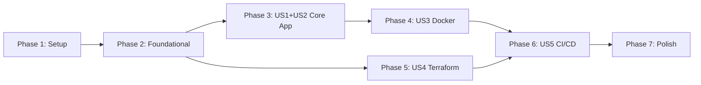

# Tasks: Schnucks Coupon Clipper

**Input**: Design documents from `/specs/1-coupon-clipper/`  
**Prerequisites**: plan.md ✅, spec.md ✅, research.md ✅, data-model.md ✅, contracts/ ✅

## Format: `[ID] [P?] [Story] Description`

- **[P]**: Can run in parallel (different files, no dependencies)
- **[Story]**: Which user story this task belongs to (US1-US5)
- All paths are relative to repository root

---

## Phase 1: Environment Setup (Shared Infrastructure)

**Purpose**: Project initialization and development tooling

- [x] T001 Create project structure with `src/`, `tests/`, `infra/`, `.github/` directories
- [x] T002 Initialize Node.js project with `package.json` including TypeScript, Playwright, ESLint, Prettier dependencies
- [x] T003 [P] Create `tsconfig.json` with TypeScript strict mode configuration
- [x] T004 [P] Create `.eslintrc.json` with linting rules per constitution
- [x] T005 [P] Create `.prettierrc` with code formatting configuration
- [x] T006 [P] Create `.env.example` with environment variable template (SCHNUCKS_BASE_URL, DATA_PATH)
- [x] T007 [P] Create `.dockerignore` with node_modules, .git, tests exclusions
- [x] T008 [P] Create `.gitignore` with node_modules, dist, .env, data/ exclusions

**Checkpoint**: Development environment ready for implementation

---

## Phase 2: Foundational (Blocking Prerequisites)

**Purpose**: Core utilities that ALL user stories depend on

**⚠️ CRITICAL**: No user story work can begin until this phase is complete

- [x] T009 Implement configuration loader in `src/config.ts` with dotenv, typed config export, required var validation
- [x] T010 Implement structured logger in `src/logger.ts` with JSON output, log levels (debug/info/warn/error), timestamps
- [x] T011 [P] Create unit test for config in `tests/unit/config.test.ts` with missing var and valid config scenarios
- [x] T012 [P] Create unit test for logger in `tests/unit/logger.test.ts` with output format verification

**Checkpoint**: Foundation ready - user story implementation can now begin

---

## Phase 3: User Story 1+2 - Core Application Logic (Priority: P1) 🎯 MVP

**Goal**: Automatically clip all available Schnucks coupons with session persistence

**Independent Test**: Run application with valid session, verify unclipped coupons become clipped

> [!NOTE]
> User Stories 1 (Automated Clipping) and 2 (Session Persistence) are combined as they share the same core implementation.

### Implementation for US1+US2

- [x] T013 [P] [US1] Implement session management in `src/session.ts` with loadContext(), saveContext(), session validation
- [x] T014 [P] [US1] Implement API client in `src/api.ts` with getCoupons(), clipCoupon(), exponential backoff retry logic
- [x] T015 [US1] Implement coupon clipper in `src/clipper.ts` with clipAllCoupons() orchestration, filtering, summary stats
- [x] T016 [US1] Implement CLI entry point in `src/index.ts` with argument parsing, Playwright init, error handling, exit codes
- [x] T016b [US1] Implement session initialization script in `src/session-init.ts` for manual TFA login
- [x] T017 [P] [US1] Create unit test for session in `tests/unit/session.test.ts` with load/save, expiration detection scenarios
- [x] T018 [P] [US1] Create unit test for API in `tests/unit/api.test.ts` with response parsing, retry logic verification
- [x] T019 [P] [US1] Create unit test for clipper in `tests/unit/clipper.test.ts` with mocked API, summary calculation
- [x] T020 [US1] Create integration test in `tests/integration/clipper.integration.test.ts` with full flow mock

**Checkpoint**: Core application functional - can clip coupons with persisted session locally

---

## Phase 4: User Story 3 - Containerized Deployment (Priority: P2)

**Goal**: Package application as minimal Docker container for consistent deployment

**Independent Test**: Build Docker image and run container successfully completing a clip cycle

### Implementation for US3

- [x] T021 [US3] Create multi-stage `Dockerfile` with Alpine build stage, Playwright runtime, non-root user, volume mount
- [x] T022 [P] [US3] Add build script to `package.json` with TypeScript compilation command
- [x] T023 [US3] Verify Docker build succeeds with `docker build -t schnucks-clipper:test .`
- [x] T024 [US3] Test container run with `docker run -v $(pwd)/data:/data schnucks-clipper:test`
- [x] T025 [US3] Verify final image size is under 500MB target

**Checkpoint**: Containerized application ready for cloud deployment

---

## Phase 5: User Story 4 - OpenTofu Infrastructure (Priority: P2)

**Goal**: Define Azure infrastructure as code with Container App Jobs and File Share using OpenTofu

**Independent Test**: Run `tofu plan` and `tofu apply` to provision resources

### Storage Module

- [x] T026 [P] [US4] Create `infra/modules/storage/variables.tf` with resource_group_name, location, storage_account_name, file_share_name
- [x] T027 [P] [US4] Create `infra/modules/storage/main.tf` with Azure Storage Account, File Share resources
- [x] T028 [P] [US4] Create `infra/modules/storage/outputs.tf` with storage_account_name, file_share_name, primary_access_key

### Container Job Module

- [x] T029 [P] [US4] Create `infra/modules/container-job/variables.tf` with job_name, container_image, schedule_cron, storage params
- [x] T030 [P] [US4] Create `infra/modules/container-job/main.tf` with Container App Environment, Job, File Share mount
- [x] T031 [P] [US4] Create `infra/modules/container-job/outputs.tf` with container_app_job_id, environment_id

### Root OpenTofu Configuration

- [x] T032 [US4] Create `infra/providers.tf` with Azure provider, required versions, backend config
- [x] T033 [US4] Create `infra/variables.tf` with subscription_id, resource_group_name, location, container_image, schedule_cron
- [x] T034 [US4] Create `infra/main.tf` with resource group, storage module call, container-job module call
- [x] T035 [US4] Create `infra/outputs.tf` with resource_group_name, container_job_name, file_share_url
- [x] T036 [US4] Validate OpenTofu with `cd infra && tofu init && tofu validate`
- [x] T037 [US4] Test with `tofu plan` (requires Azure credentials)

**Checkpoint**: Infrastructure code ready for deployment

---

## Phase 6: User Story 5 - GitHub Actions CI/CD (Priority: P3)

**Goal**: Automate build, test, and deploy with GitHub Actions workflows

**Independent Test**: Push commit and verify pipeline executes successfully

### CI Workflow

- [x] T038 [P] [US5] Create `.github/workflows/ci.yaml` with PR trigger, Node.js setup, lint, typecheck, test, Docker build
- [x] T039 [P] [US5] Create `.github/workflows/terraform.yaml` with infra/ trigger, terraform init/validate/plan, PR comment
- [x] T040 [US5] Create `.github/workflows/cd.yaml` with main merge trigger, GHCR push, terraform apply, job update
- [x] T041 [US5] Document required secrets (AZURE_CREDENTIALS, AZURE_SUBSCRIPTION_ID, GHCR_TOKEN) in `README.md`

**Checkpoint**: Full CI/CD automation complete

---

## Phase 7: Polish & Cross-Cutting Concerns

**Purpose**: Documentation, quality improvements, final validation

- [ ] T042 [P] Create comprehensive `README.md` with project overview, setup, usage, deployment instructions
- [ ] T043 [P] Update `specs/1-coupon-clipper/quickstart.md` with verified commands after implementation
- [ ] T044 Run full local verification: lint, typecheck, test, Docker build
- [ ] T045 Validate against spec.md success criteria (SC-001 through SC-008)
- [ ] T046 Code cleanup and formatting check with `npm run lint:fix && npm run format`

---

## Dependencies & Execution Order

### Phase Dependencies



### User Story Dependencies

| Story | Depends On | Can Start After |
|-------|------------|-----------------|
| **US1+US2** (Core App) | Phase 2 | Foundational complete |
| **US3** (Docker) | US1+US2 | Core app compiles and runs |
| **US4** (Terraform) | Phase 2 | Can parallelize with US1+US2 |
| **US5** (CI/CD) | US3, US4 | Docker + Terraform both ready |

### Parallel Opportunities

**Within Phase 1** (all can run in parallel):
- T003, T004, T005, T006, T007, T008

**Within Phase 3** (models/tests in parallel):
- T013, T014 (then T015, T016 sequentially)
- T017, T018, T019 (all tests parallel)

**Within Phase 5** (modules in parallel):
- T026, T027, T028 (storage module)
- T029, T030, T031 (container-job module)
- Then T032-T037 sequentially

**Within Phase 6** (CI/Terraform workflows parallel):
- T038, T039 (then T040, T041 sequentially)

---

## Parallel Example: Phase 3 Models

```bash
# Launch in parallel:
Task: "T013 Implement session management in src/session.ts"
Task: "T014 Implement API client in src/api.ts"

# After both complete:
Task: "T015 Implement coupon clipper in src/clipper.ts"
```

---

## Implementation Strategy

### MVP First (User Stories 1+2 Only)

1. Complete Phase 1: Setup (8 tasks)
2. Complete Phase 2: Foundational (4 tasks)
3. Complete Phase 3: US1+US2 Core App (8 tasks)
4. **STOP and VALIDATE**: Test locally with real session
5. **MVP Complete**: Core coupon clipping works

### Incremental Delivery

| Milestone | Phases | Deliverable |
|-----------|--------|-------------|
| **MVP** | 1, 2, 3 | Local coupon clipping works |
| **Containerized** | + 4 | Docker image ready |
| **Cloud Ready** | + 5 | Terraform deploys to Azure |
| **Automated** | + 6, 7 | Full CI/CD pipeline |

---

## Summary

| Metric | Value |
|--------|-------|
| **Total Tasks** | 46 |
| **Phase 1 (Setup)** | 8 tasks |
| **Phase 2 (Foundational)** | 4 tasks |
| **Phase 3 (US1+US2)** | 8 tasks |
| **Phase 4 (US3 Docker)** | 5 tasks |
| **Phase 5 (US4 Terraform)** | 12 tasks |
| **Phase 6 (US5 CI/CD)** | 4 tasks |
| **Phase 7 (Polish)** | 5 tasks |
| **Parallelizable Tasks** | 26 (57%) |
| **Suggested MVP Scope** | Phases 1-3 (20 tasks) |

---

## Notes

- [P] tasks = different files, no dependencies on incomplete tasks
- [Story] label maps task to specific user story for traceability
- Verify tests fail before implementing (TDD approach optional)
- Commit after each task or logical group
- Stop at any checkpoint to validate story independently
